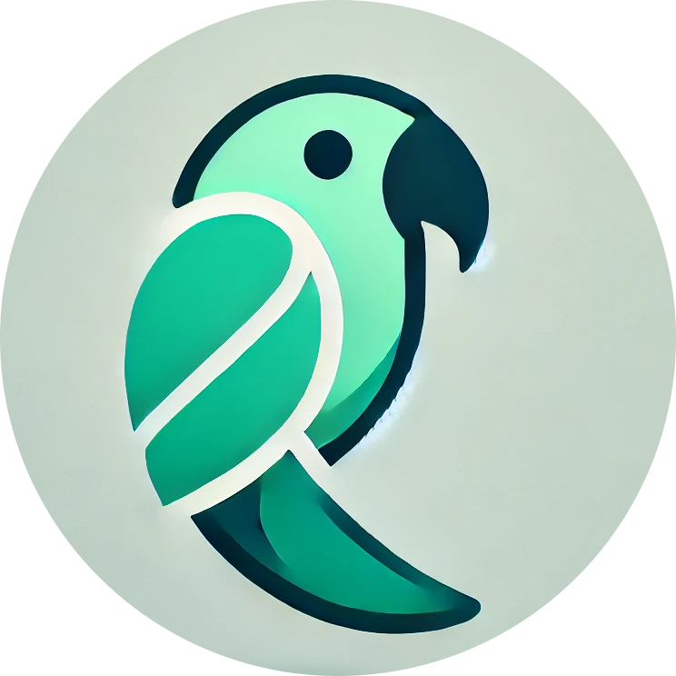

<table>
<tr>
<td width="70%" valign="top">

<h1 align="left">
  
    hi, ParrotGames
  
</h1>

<blockquote>
  <i style="font-size: 14px; color: #a78bfa;">developer</i>
</blockquote>

 💫 I'm a **Full Stack Developer** who loves building apps as a hobby.

</td>

<td width="30%" align="center">

</td>
</tr>
</table>

### 🔧 What I Build
- 🤖 **Discord bots** (automation, utility, moderation, fun features)  
- 🌐 **Web applications** with both frontend & backend components  
- ⚙️ **Experimental projects** exploring APIs, dashboards, automation, and more  

